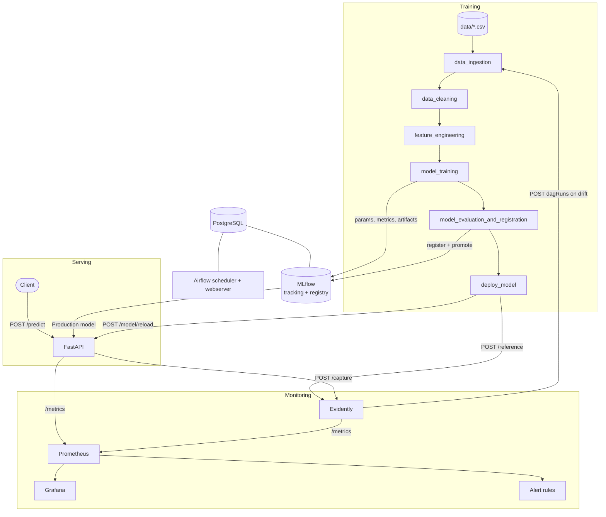

# Architecture

## 1. Problem definition

### Business context

A wine producer grades every batch before bottling. The grade comes from a tasting panel, which is slow and
expensive: each batch waits for the panel, and panel time is limited. Laboratory measurements (acidity, sugar,
sulphur dioxide, alcohol, ...) are cheap and available for every batch within minutes.

The system uses those measurements to answer one question: **is this wine likely to be rated good (quality
score >= 6 out of 10)?** The prediction is a pre-screening signal. Batches predicted "not good" can be reworked
or sent to the panel first; the panel keeps the final word.

The business scenario is an assumption made for this project. The data is the public UCI Wine Quality dataset
(Cortez et al., 2009): 1,599 red and 4,898 white Portuguese *vinho verde* wines.

### Why this needs MLOps and not only a model

The producer starts with red wine and later adds white wine. The chemistry of white wine is different (much more
residual sugar and sulphur dioxide), so a model trained on red wine silently degrades. The system must notice
that the incoming data changed and retrain without a person watching it.

### Users and use cases

| User | Use case |
|---|---|
| Quality control application | Sends the lab measurements of a batch, receives good / not good in real time |
| ML engineer | Tracks experiments, compares model versions, inspects why a model was promoted |
| Operations | Watches dashboards and alerts, is told when the API is down or the data drifts |

### Requirements

| Priority | Functional requirement |
|---|---|
| Must | Predict wine quality (good / not good) from 11 measurements through a REST API |
| Must | Train, evaluate and register models with a reproducible, versioned pipeline |
| Must | Detect drift between production inputs and training data |
| Must | Retrain automatically on drift and deploy the new model only if it is not worse |
| Should | Report fairness across wine colors and explain what drives predictions |
| Could | Simulate richer traffic scenarios (gradual drift, spikes) |

| Priority | Non-functional requirement |
|---|---|
| Must | Whole system starts with one command (`docker compose up`) |
| Must | Prediction latency p95 below 500 ms |
| Must | Test coverage of at least 80%, enforced in CI |
| Should | Every component exposes a health check; failures raise an alert |
| Should | No manual step between drift detection and the new model being served |

### Success metrics

| Level | Metric | Target | Measured |
|---|---|---|---|
| Business | Share of batches the pre-screening classifies correctly | >= 75% | 76.1% (accuracy on 1,065 held-out wines) |
| Business | Time from data drift to a retrained model in production | < 10 minutes, no manual step | about 2 minutes in the demo |
| Model | Accuracy on the held-out test set | >= 0.75 | 0.761 |
| Model | Cross-validated accuracy (5 folds) | >= 0.75, std <= 0.03 | 0.769 +/- 0.010 |
| Model | Accuracy gap between red and white wine | <= 0.05 | 0.030 |
| System | p95 latency of `/predict` | < 500 ms | about 50 ms (local demo, 350 requests) |
| System | Server error rate | < 5% | 0% in the demo |
| System | Test coverage | >= 80% | 96% |

Measurements come from a single local run of the pipeline and demo; they are not a load test.

### Scope and constraints

- In scope: tabular binary classification, one model, single-machine deployment with Docker Compose.
- Out of scope: authentication, horizontal scaling, cloud deployment, online labelling of production data.
- Constraint: production traffic has no labels. Retraining therefore uses labelled data already collected
  (the white wine file plays the role of "newly labelled data"). In a real deployment the tasting panel's
  grades would arrive later and feed the same pipeline.

## 2. System architecture

### Components and responsibilities

| Component | Responsibility | Code |
|---|---|---|
| Pipeline library | All ML logic as plain functions, independent of Airflow so it is unit-testable | `src/` |
| Airflow DAG | Orders the steps, passes files between them, decides whether to deploy | `airflow/dags/ml_pipeline_dag.py` |
| MLflow | Stores runs (params, metrics, artifacts), model versions and their stage | `mlflow/` |
| Serving API | Loads the Production model, validates input, predicts, exports metrics, forwards inferences | `api/main.py` |
| Evidently service | Keeps reference and production data, runs drift tests, triggers retraining | `evidently/main.py` |
| Prometheus | Scrapes the API and Evidently, evaluates 24 alert rules | `config/prometheus*` |
| Grafana | Two provisioned dashboards: model serving and data drift | `config/grafana/` |

## 3. Data flow

### Training (initial and retraining use the same DAG)

1. **Ingest**: read the CSV of each requested color, add a `color` column.
2. **Clean**: fail if a column is missing, cast to float, fill nulls with the median, drop duplicated rows
   (1,177 of 6,497), create the binary target `quality >= 6`.
3. **Feature engineering**: stratified 80/20 split per color, fit a `StandardScaler` on the training part.
4. **Train**: grid search over 12 random forest configurations with shuffled 5-fold cross-validation.
   The scaler and the best model are bundled in one scikit-learn `Pipeline`, logged to MLflow together with
   the test metrics, every grid candidate, fairness metrics and the explainability report.
5. **Evaluate and register**: the candidate and the current Production model are scored on the **same** test
   set. The candidate is promoted when its accuracy is not lower.
6. **Deploy**: only if promoted. The API reloads the model and Evidently receives the new training data as
   reference.

### Serving and monitoring

1. The client posts 11 numbers to `/predict`. The API rejects a wrong count with `400`.
2. The model predicts; the API returns the prediction with a unique `prediction_id` and the model version.
3. Request and prediction metrics are exported for Prometheus (scraped every 5 s).
4. In the background the API forwards the features and prediction to Evidently.

### Drift to retraining

1. `POST /analyze` on Evidently compares the last N captured inferences with the reference data, one
   Kolmogorov-Smirnov test per feature.
2. If at least 30% of the features drift, Evidently calls the Airflow REST API and the DAG runs on all data.
3. The API serves the new version; drift is from then on measured against the new training data.

### Edge cases

| Case | Behaviour |
|---|---|
| API starts before any model exists | Starts anyway, `/health` reports `unhealthy`, `/predict` returns `503`, alert `ModelNotLoaded` |
| Wrong number of features or invalid body | `400` / `422` with a message, nothing reaches the model |
| Evidently is down | The prediction still succeeds; the failed capture is logged as a warning |
| Airflow is down when drift is detected | `/analyze` returns `retrain_triggered: false`; the demo script exits with an error |
| Retrained model is worse than Production | Not registered, `deploy_model` is skipped, API and reference stay unchanged |
| A CSV lacks a column | `clean_data` raises, the DAG run fails before any training |
| Two retraining requests at once | The DAG allows one active run; the second waits |

## 4. Technology choices and trade-offs

| Decision | Chosen | Alternative | Why, and what it costs |
|---|---|---|---|
| Model | Random forest | Gradient boosting, neural network | Strong on small tabular data, no GPU, built-in importances and fast SHAP. Costs some accuracy against a tuned boosting model. |
| Orchestration | Airflow | Cron, Prefect | REST API to trigger runs, per-task retries and logs, a UI for the demo. Heavy: three containers and a database for one DAG. |
| Tracking and registry | MLflow | Weights & Biases, DVC | Self-hosted, registry stages give a simple promotion mechanism. Stages are deprecated in newer MLflow in favour of aliases. |
| Artifact store | MLflow server with a Docker volume | MinIO / S3 | One container less and no host path. Not suitable for several machines; S3 would be needed to scale out. |
| Serving | FastAPI | MLflow model serving, BentoML | Full control over validation, metrics and the capture hook; OpenAPI for free. More code to maintain. |
| Drift detection | Evidently, K-S test per feature | Custom tests, Wasserstein distance | Standard reports and presets. Evidently's default (Wasserstein above 1,000 reference rows) flagged 6 to 10 of 11 features on normal traffic of 100 rows, K-S flagged 0 to 2. |
| Retraining trigger | Evidently calls Airflow directly | Prometheus alert through Alertmanager | Fewer moving parts and a synchronous answer for the demo. Couples the two services. |
| Promotion rule | Accuracy on a shared test set, not lower than Production | Fixed threshold, manual approval | Fully automatic and comparable. A single metric can hide a regression on one group, see RESPONSIBLE_AI.md. |
| Deployment | Docker Compose | Kubernetes | One command on a laptop. No autoscaling, no rolling updates, single point of failure. |
| Inference store | In memory inside Evidently (last 10,000 rows) | PostgreSQL table | Simplest thing that supports the drift window. Lost on restart. |

### Scalability, cost, complexity

- **Scalability**: the API is stateless and could run as several replicas behind a load balancer. The Evidently
  service and the Airflow `LocalExecutor` are single instances and would be the first bottlenecks.
- **Cost**: everything is open source and runs on one machine. The largest cost is memory: Airflow, MLflow and
  Postgres run all the time for a pipeline that takes about two minutes per run.
- **Complexity**: eight containers for one small model is deliberate, since the goal is to exercise the full
  lifecycle. For a real project of this size, a scheduled script and a managed model registry would be enough.

## 5. Known limitations

- Retraining depends on labelled data being available; production traffic itself is unlabelled.
- Drift analysis runs when `/analyze` is called (by the demo script), not on a schedule.
- The test set changes when new colors are added, so accuracy across model versions is compared through
  `production_accuracy` (old model on the new test set), not through each run's own `accuracy`.
- Credentials in `docker-compose.yml` are development defaults (`admin` / `admin`).
