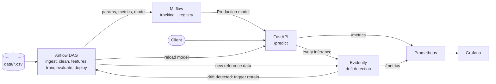

# Wine Quality MLOps Pipeline (DDM501 Final Project)

[](https://github.com/phamminhhoang1985/DDM501_FinalProject_25MS13285_PhamMinhHoang/actions/workflows/ci-cd.yml)


An end-to-end ML system that predicts whether a wine is **good** (quality score >= 6) from 11 laboratory
measurements, serves the model over a REST API, monitors it, detects data drift and **retrains itself**.

The demo scenario: the model is trained on red wine, production traffic then shifts to white wine,
Evidently detects the drift, Airflow retrains on both colors, and the API switches to the new model.

| Document | Content |
|---|---|
| [ARCHITECTURE.md](ARCHITECTURE.md) | Problem definition, requirements, success metrics, system design, trade-offs |
| [RESPONSIBLE_AI.md](RESPONSIBLE_AI.md) | Fairness analysis, explainability, privacy, ethics |
| [CONTRIBUTING.md](CONTRIBUTING.md) | Team roles and development workflow |

## Architecture



| Service | Port | Role |
|---|---|---|
| FastAPI | 8000 | Model serving, Prometheus metrics, forwards inferences to Evidently |
| MLflow | 5000 | Experiment tracking, model registry, artifact store |
| Airflow | 8080 | Training and retraining pipeline (`admin` / `admin`) |
| Evidently | 8001 | Drift detection service, triggers retraining |
| Prometheus | 9090 | Metrics and alert rules |
| Grafana | 3000 | Dashboards (`admin` / `admin`) |
| PostgreSQL | 5432 | Backend database for MLflow and Airflow |

## Prerequisites

- Docker Desktop with Docker Compose v2
- Python 3.10 or 3.11 (only for the two helper scripts and the tests)

## Quick start

```bash
# 1. Configuration
cp .env.example .env

# 2. Start all services (first build takes a few minutes)
docker compose up -d --build

# 3. Train the first model (red wine only) - takes about 1 minute
pip install requests colorama
python scripts/training.py

# 4. Check that the API serves it
curl http://localhost:8000/health
```

`scripts/training.py` triggers the Airflow DAG and waits for it. The DAG tunes the model, registers it in
MLflow as Production, tells the API to load it and uploads the training data to Evidently as drift reference.

## Making a prediction

```bash
curl -X POST http://localhost:8000/predict \
  -H "Content-Type: application/json" \
  -d '{"features": [7.4, 0.7, 0.0, 1.9, 0.076, 11.0, 34.0, 0.9978, 3.51, 0.56, 9.4]}'
```

```json
{
  "prediction_id": "12ab2110-e845-443d-b8ae-e18ff8ee4a5c",
  "prediction": 0.0,
  "model_name": "wine_quality_model",
  "model_version": "1",
  "timestamp": "2026-10-03T16:30:38.938645",
  "latency_ms": 4.2
}
```

The 11 features, in order: `fixed_acidity`, `volatile_acidity`, `citric_acid`, `residual_sugar`, `chlorides`,
`free_sulfur_dioxide`, `total_sulfur_dioxide`, `density`, `pH`, `sulphates`, `alcohol`.

`prediction` is `1` for a good wine (quality >= 6) and `0` otherwise.

| Endpoint | Purpose |
|---|---|
| `POST /predict` | Predict; `400` on wrong feature count, `503` if no model is loaded |
| `GET /health` | `healthy` once a model is loaded |
| `GET /model/info` | Name, version and registry URI of the served model |
| `POST /model/reload` | Load the current Production model from MLflow |
| `GET /metrics` | Prometheus metrics |
| `GET /docs` | Interactive OpenAPI (Swagger) documentation |

## Drift and retraining demo

```bash
python scripts/simulate_drift_and_retrain.py
```

| Step | What happens | Expected output |
|---|---|---|
| 1 | 100 red wine samples are sent to `/predict` | `drifted features: 0/11`, no drift |
| 2 | 250 white wine samples are sent | |
| 3 | Evidently compares them with the training data | `drifted features: 10/11` or `11/11`, drift, DAG triggered |
| 4 | Airflow retrains on red + white and deploys | `API now serves model version 2 (was 1)` |

What to look at afterwards:

- **Airflow** (http://localhost:8080): the second DAG run, triggered by `evidently_drift_monitor`.
- **MLflow** (http://localhost:5000): the new run shows `accuracy` against `production_accuracy` (the old model
  on the same test set), the cross-validation results, fairness metrics and the explainability report.
- **Evidently** (http://localhost:8001/reports): the HTML drift reports of steps 1 and 3.
- **Grafana** (http://localhost:3000): request rate, latency and drift dashboards.

## Results

Measured by the pipeline on the held-out test set (1,065 wines: 272 red, 793 white).

| Model | Trained on | Accuracy on red + white test set |
|---|---|---|
| Version 1 | red wine (1,087 rows) | 0.707 |
| Version 2 (after retraining) | red + white wine (4,255 rows) | 0.761 |

Version 1 scores 0.776 on red wine alone but only 0.683 on white wine, which is why retraining is needed once
white wine appears in production. Details per color are in [RESPONSIBLE_AI.md](RESPONSIBLE_AI.md).

## Development

```bash
python -m venv .venv
source .venv/bin/activate        # Windows: .\.venv\Scripts\Activate.ps1
pip install -r requirements.txt

make test    # pytest with coverage of src/ and api/
make lint    # flake8 + ruff
```

| Test file | Type | Covers |
|---|---|---|
| `tests/test_data.py` | Unit + data quality | Schema, nulls, duplicates, target, train/test split, scaler |
| `tests/test_train.py`, `tests/test_evaluate.py` | Unit | Training, tuning, MLflow logging, promotion rule |
| `tests/test_model.py` | Model validation | Minimum accuracy, reproducibility, output classes |
| `tests/test_api.py` | Integration | The real FastAPI app: every endpoint and error path |
| `tests/test_fairness.py`, `tests/test_explainability.py` | Unit | Responsible AI modules |

96 tests, 96% coverage of `src/` and `api/`.

## CI/CD

`.github/workflows/ci-cd.yml` runs on a self-hosted runner: **lint** -> **test** (fails under 80% coverage)
-> **build** (all Docker images) -> **deploy** (`docker compose up`, then waits for `/health`; `main` only).

## Monitoring and alerting

- **Dashboards**: `ML Model Monitoring` (traffic, latency percentiles, errors, predictions) and
  `Evidently - Data Drift Monitoring`, both provisioned automatically in Grafana.
- **Alerts**: 24 Prometheus rules in `config/prometheus/` (see http://localhost:9090/alerts), for example
  `ModelAPIDown`, `ModelNotLoaded`, `HighErrorRate` (> 5% of requests), `HighPredictLatency` (p95 > 500 ms)
  and `DataDriftDetected`.

## Project structure

```text
├── airflow/            Airflow image and the training DAG
├── api/                FastAPI serving service
├── config/             Prometheus config, alert rules, Grafana dashboards
├── data/               UCI Wine Quality CSVs (red, white)
├── evidently/          Drift detection service
├── mlflow/             MLflow server image
├── scripts/            training.py (initial training), simulate_drift_and_retrain.py (demo)
├── simulations/        Optional traffic simulator with more scenarios
├── src/                Pipeline logic: data, features, train, evaluate, fairness, explainability
├── tests/              Unit, integration, data quality and model validation tests
└── docker-compose.yml  All services
```

## Troubleshooting

| Symptom | Cause and fix |
|---|---|
| `port is already allocated` on `docker compose up` | Another program uses the port. Change `API_PORT`, `GRAFANA_PORT`, `POSTGRES_PORT`, ... in `.env`. If you change `API_PORT`, run the demo with `API_URL=http://localhost:<port>`. |
| `/health` returns `"status": "unhealthy"` | No model has been trained yet. Run `python scripts/training.py`. |
| `/predict` returns `503 Model not loaded` | Same as above, or call `POST /model/reload` after training. |
| Postgres exits with `bad interpreter: /bin/bash^M` | `scripts/init-db.sh` was checked out with Windows line endings. Run `git add --renormalize .` and check the file out again; `.gitattributes` keeps `*.sh` in LF. |
| `scripts/training.py` prints `Request failed` | Airflow is still starting. Wait until http://localhost:8080 answers, then retry. |
| Demo prints `drift flagged on normal traffic` | Evidently has no or an old reference. Re-run `python scripts/training.py`, which uploads it. |
| Start again from an empty state | `docker compose down -v` removes the containers and volumes, then repeat the quick start. |

## Dataset

P. Cortez, A. Cerdeira, F. Almeida, T. Matos, J. Reis. *Modeling wine preferences by data mining from
physicochemical properties.* Decision Support Systems, 2009. Available from the
[UCI Machine Learning Repository](https://archive.ics.uci.edu/dataset/186/wine+quality).

## Team

Pham Minh Hoang, Nguyen Cong Trong, Ngo Minh Khoi. See [CONTRIBUTING.md](CONTRIBUTING.md).
