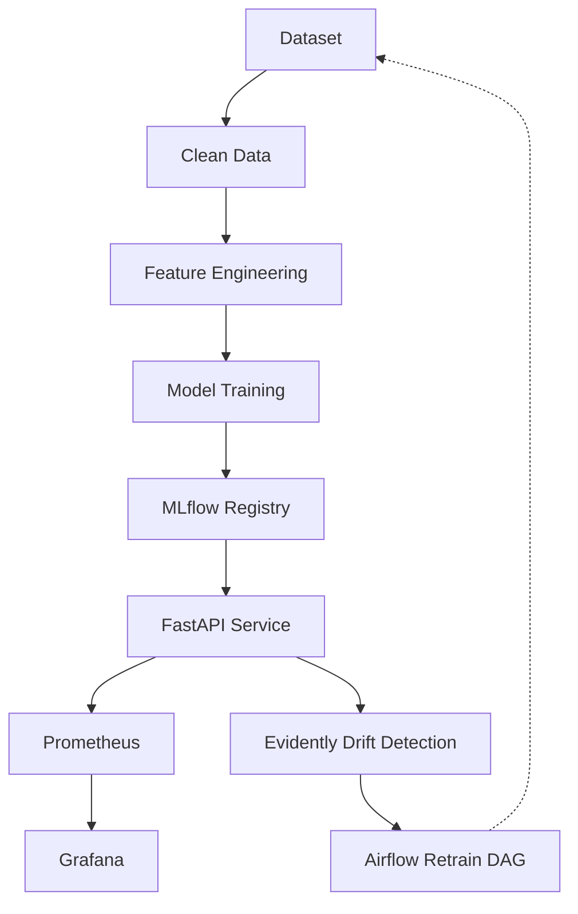

# DDM501 - End-to-End MLOps Pipeline

## Architecture

## Tech Stack
- ML: scikit-learn
- Tracking: MLflow, MinIO (S3 backend)
- Serving: FastAPI
- Monitoring: Prometheus, Grafana, Evidently
- Orchestration: Airflow
- CI/CD: GitHub Actions
- Infrastructure: Docker Compose

## Prerequisites
- Docker & Docker Compose
- Python 3.10+
- Make

## Quick Start
1. Clone the repository and navigate to `ml-monitoring`.
2. Create environment file: `cp .env.example .env` (update USER as needed).
3. Start all services: `make up` (or `docker compose up -d`).
4. Train initial model: `make train` (or `python scripts/training.py`).
5. Access services:
   - FastAPI: http://localhost:8000
   - MLflow: http://localhost:5000
   - Grafana: http://localhost:3000
   - Prometheus: http://localhost:9090
   - Evidently: http://localhost:8001
   - Airflow: http://localhost:8080

## Running the Drift Demo
Run `make simulate-drift` (or `python scripts/simulate_drift_and_retrain.py`).
What happens:
- **Step 1:** Sends normal requests to API.
- **Step 2:** Sends perturbed (drifted) requests to API.
- **Step 3:** Analyzes data with Evidently.
- **Step 4:** Triggers Airflow DAG to retrain the model if drift is detected.

## Testing & Quality
- Run tests: `make test`
- Lint code: `make lint`

## CI/CD
GitHub Actions workflow automatically lints, tests, and builds docker images on push/PR, and deploys to self-hosted runner when merging to `main`.

## Service Architecture
| Service | Port | Description |
|---------|------|-------------|
| FastAPI | 8000 | Model Serving API |
| MLflow | 5000 | Experiment & Model Tracking |
| MinIO | 9000 | S3 Object Storage |
| Prometheus | 9090 | Metrics Scraping |
| Grafana | 3000 | Metrics Dashboard |
| Evidently | 8001 | Data Drift Analysis |
| Airflow | 8080 | Workflow Orchestration |
| Postgres | 5432 | Database for MLflow/Airflow |

---
**Author:** Pham Minh Hoang